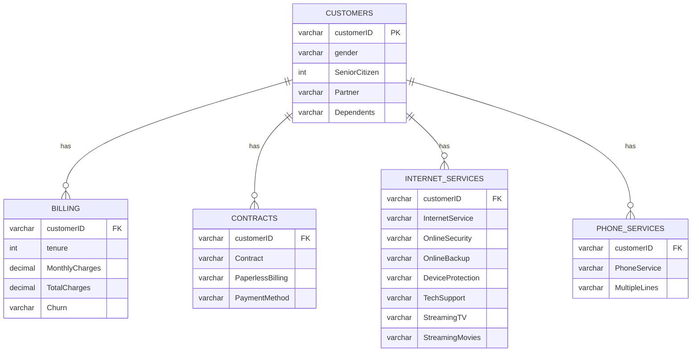

# Telco Churn Analysis Report

## 1) Abstract
This project builds an end-to-end churn analysis workflow for a telecom customer dataset using MySQL and a natural-language AI interface. The primary goal is to identify churn drivers, quantify revenue risk, and support retention strategy design through both SQL analytics and an LLM-powered text-to-SQL agent.

The dataset contains 7,043 customer records with demographic attributes, subscription and service details, billing behavior, and churn labels. To support flexible analytics, the data was modeled into a normalized relational schema centered on the `customers` table, with dependent tables for billing, contracts, internet services, and phone services.

On top of the database layer, a LangChain SQL agent was integrated for natural-language querying. The current implementation in code uses Groq as the LLM backend, while the same architecture can be configured for Gemini. This report presents schema design, SQL analysis patterns, indexing and optimization observations, AI integration flow, and business insights generated from live query execution.

## 2) Problem & Dataset
Customer churn is one of the most expensive operational risks in telecom. Acquiring new customers is typically costlier than retaining existing ones, so identifying high-risk segments early is critical. The business problem addressed here is:

- Detect which customer segments churn at the highest rates.
- Estimate monthly revenue exposure caused by churn.
- Generate actionable retention strategies using both SQL and AI-assisted analysis.

### Dataset Overview
The dataset follows the typical telco churn structure and includes:

- Customer identity and demographics (`customerID`, gender, senior status, dependents).
- Contract and billing behavior (`Contract`, `PaperlessBilling`, `PaymentMethod`, `MonthlyCharges`, `TotalCharges`, `tenure`).
- Service adoption (`InternetService`, `TechSupport`, `OnlineSecurity`, `StreamingTV`, etc.).
- Target label (`Churn`: Yes/No).

Key summary statistics from the live database:

- Total customers: 7,043
- Overall churn rate: 26.54%
- Average monthly charges: 64.76
- Average tenure: 32.37 months
- Monthly revenue tied to churned accounts: 139,130.85

## 3) Database Design
The schema was organized into five related tables:

- `customers` (master entity, one row per customer)
- `billing`
- `contracts`
- `internet_services`
- `phone_services`

### Normalization Summary
The design mostly aligns with 3NF goals:

- Customer identity and demographics are isolated in `customers`.
- Subject-specific attributes are split into domain tables (billing, contract, internet, phone).
- Joins are performed on `customerID`, reducing duplication of static profile data.

Current structural observation:

- `customers.customerID` is enforced as a primary key.
- Child tables reference `customers.customerID` via foreign keys.
- Child tables currently do not expose explicit primary keys in metadata, which is functional for analysis but should be hardened for stricter integrity (recommended: primary or unique constraints on each child table's `customerID` if one-to-one is intended).

### ER Diagram


## 4) Implementation
Implementation combines Python, SQLAlchemy, and MySQL:

- Connection setup is centralized in `db_config.py` using environment variables.
- Connection validation is performed in `database_test.py`.
- Query and AI orchestration are handled by `ai_agent.py` and `chat_api.py`.

### MySQL Schema and Data Population
Data appears to be loaded from the telco churn source into normalized target tables keyed by `customerID`. Core relationships are implemented through foreign keys from each domain table to `customers`.

### Constraints and Integrity
Observed constraints and indexes include:

- Foreign keys from `billing`, `contracts`, `internet_services`, and `phone_services` to `customers(customerID)`.
- Join-supporting indexes on `customerID` in child tables.
- Additional index `idx_churn` on `billing.Churn` to accelerate churn-filtered queries.

Recommended hardening:

- Enforce `PRIMARY KEY (customerID)` or `UNIQUE (customerID)` on each child table if data cardinality is one-to-one.
- Add `NOT NULL` on core analytical fields (`Churn`, `MonthlyCharges`, `Contract`, `InternetService`) to reduce data quality drift.

## 5) SQL Analysis
The analysis relied on three main SQL styles: joins, aggregations, and subqueries.

### A) Join + Aggregation: Churn by Contract
```sql
SELECT c.Contract,
       COUNT(*) AS customers,
       ROUND(100 * AVG(CASE WHEN b.Churn='Yes' THEN 1 ELSE 0 END), 2) AS churn_rate_pct
FROM billing b
JOIN contracts c ON c.customerID = b.customerID
GROUP BY c.Contract
ORDER BY churn_rate_pct DESC;
```
Result highlights:

- Month-to-month: 42.71% churn (3,875 customers)
- One year: 11.27% churn (1,473 customers)
- Two year: 2.83% churn (1,695 customers)

### B) Join + Aggregation: Churn by Internet Service
```sql
SELECT i.InternetService,
       COUNT(*) AS customers,
       ROUND(100 * AVG(CASE WHEN b.Churn='Yes' THEN 1 ELSE 0 END), 2) AS churn_rate_pct
FROM billing b
JOIN internet_services i ON i.customerID = b.customerID
GROUP BY i.InternetService
ORDER BY churn_rate_pct DESC;
```
Result highlights:

- Fiber optic: 41.89% churn
- DSL: 18.96% churn
- No internet: 7.40% churn

### C) Subquery for High-Risk Segment Mining
```sql
SELECT segment, customers, churned,
       ROUND(100 * churned / customers, 2) AS churn_rate_pct
FROM (
    SELECT CONCAT(c.Contract, ' + ', i.InternetService, ' + ',
                  CASE WHEN b.tenure < 12 THEN 'Under12' ELSE '12plus' END) AS segment,
           COUNT(*) AS customers,
           SUM(CASE WHEN b.Churn='Yes' THEN 1 ELSE 0 END) AS churned
    FROM billing b
    JOIN contracts c ON c.customerID = b.customerID
    JOIN internet_services i ON i.customerID = b.customerID
    GROUP BY segment
) s
WHERE customers >= 100
ORDER BY churn_rate_pct DESC
LIMIT 8;
```
Result highlight:

- Highest-risk sizable segment: `Month-to-month + Fiber optic + Under12` at 70.55% churn (618 churned of 876).

### D) Revenue Loss Analysis
```sql
SELECT c.Contract,
       COUNT(*) AS churned_customers,
       ROUND(SUM(b.MonthlyCharges), 2) AS monthly_revenue_loss
FROM billing b
JOIN contracts c ON c.customerID = b.customerID
WHERE b.Churn='Yes'
GROUP BY c.Contract
ORDER BY monthly_revenue_loss DESC;
```
Result highlights:

- Month-to-month contributes 120,847.10 monthly churn loss (largest share).
- One-year contributes 14,118.45.
- Two-year contributes 4,165.30.

## 6) Optimization
Performance diagnostics with `EXPLAIN` show mixed access paths:

- Some grouped churn queries still perform full scans (`type=ALL`) and temporary tables.
- High-risk customer extraction benefits from `idx_churn` on `billing.Churn`.
- Sorting by `MonthlyCharges DESC` under churn filter may still use filesort.

### Existing Optimization
- `idx_churn` index improves filtering for `WHERE Churn='Yes'`.
- `customerID` indexes support one-row ref joins across tables.

### Recommended Improvements
1. Add composite index for churn-value ranking:
   - `CREATE INDEX idx_churn_monthly ON billing (Churn, MonthlyCharges);`
2. Strengthen contract/service group analysis with covering indexes:
   - `CREATE INDEX idx_contract_customer ON contracts (Contract, customerID);`
   - `CREATE INDEX idx_internet_customer ON internet_services (InternetService, customerID);`
3. Consider materialized summary tables (or scheduled aggregates) for dashboards with repeated group-by patterns.

## 7) AI Integration (LangChain + Gemini text-to-SQL agent)
The AI layer converts natural-language questions into SQL over the live MySQL schema.

### Integration Flow
1. User asks a question through notebook, CLI chat, or FastAPI endpoint.
2. LangChain SQL agent inspects available tables/columns.
3. LLM generates SQL, executes through SQLAlchemy, and formats response.
4. Results return to chat/UI for interpretation.

### Current Status in This Project
- Implemented stack currently uses LangChain + Groq (`ChatGroq`) as the active model backend.
- The architecture is Gemini-compatible and can be switched by replacing the LLM wrapper while keeping SQLDatabase and agent flow unchanged.
- During this session, direct SQL execution worked, but LLM chat failed due to an expired API key (401), demonstrating that database readiness and model credentials are independent operational dependencies.

## 8) Results (Key Insights Discovered)
The analysis revealed several consistent churn signals:

1. Contract type is the strongest churn discriminator.
   - Month-to-month churn (42.71%) is about 15x higher than two-year churn (2.83%).

2. Fiber optic customers show significantly elevated churn.
   - Fiber churn rate is 41.89% versus 18.96% for DSL.

3. Early-tenure attrition is severe.
   - Customers under 12 months churn at 48.28%, dropping to 12.06% for 36+ months.

4. Revenue risk is concentrated, not uniform.
   - Total monthly churn-linked revenue is 139,130.85.
   - 120,847.10 of that is in month-to-month accounts alone.

5. Segment interaction reveals an extreme risk pocket.
   - `Month-to-month + Fiber optic + Under12` reaches 70.55% churn and should be prioritized for intervention.

## 9) Conclusion
This project successfully delivered a full churn analytics pipeline: normalized MySQL design, reproducible SQL analysis, operational API integration, and a natural-language querying interface. The system can answer strategic questions such as who churns, why churn is concentrated, and where revenue is most exposed.

From a business perspective, the clearest action path is to focus retention campaigns on short-tenure, month-to-month, fiber-optic customers, where both churn probability and revenue impact are high.

Future improvements:

- Reactivate and harden AI credentials/monitoring for production-grade text-to-SQL availability.
- Add stricter primary/unique constraints in child tables for stronger integrity guarantees.
- Introduce predictive modeling (classification) and campaign uplift tracking to move from descriptive to prescriptive churn management.
- Add automated benchmark scripts to track query latency before and after index changes.
